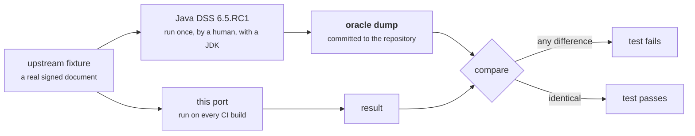

# How compatibility is verified

"Compatible with Java DSS" is a claim, and a claim about a signature library
that nobody can check is worth nothing. This page describes the mechanism; [The
numbers](numbers.md) gives the current measurements and the command that
reproduces each one.

## What compatibility means here

**Not** API-identical Java-in-Go. That would be a bad Go library, and it is an
explicit anti-goal of the port. The contract is **interoperability**, in four
specific senses:

1. **Byte and spec-level output.** Signatures produced here validate in Java
   DSS and vice versa. Canonicalization output, ASN.1 encodings, digests, and
   serialized enumeration values — names, OIDs, URIs — are exact.
2. **Verdict parity.** The same document, the same policy, the same validation
   time gives the same indication and sub-indication as Java DSS.
3. **Schema parity.** Diagnostic data and the simple, detailed and ETSI reports
   conform to the same upstream schemas, so existing tooling reads them
   unchanged.
4. **Test-vector parity.** Upstream's own `src/test/resources` — signed
   documents, certificates, policies — are reused directly as golden vectors.

## The oracle method

The technique behind nearly every parity test in this repository:



A small Java program runs the real upstream library over a set of fixtures and
dumps everything it produced — verdicts, per-check conclusions, report digests,
canonicalized bytes — as a data file. That file is **committed**. The Go test
reads it and compares, row by row.

Three properties make this worth doing:

- **The oracle is Java's answer, not ours.** Nobody wrote down what the result
  "should" be. It is a recording of what the real implementation did.
- **It runs without Java.** Every contributor and every CI build re-checks
  against real upstream behaviour with nothing installed but Go.
- **A changed oracle file is visible in review.** Adjusting an expectation to
  make a test pass is a diff someone has to approve. The port's own audit passes
  caught exactly that happening — a reviewer found four policy reference files
  edited instead of the marshaller being fixed — which is precisely the failure
  mode the committed-oracle discipline exists to expose.

Regenerating an oracle needs a JDK and a built upstream classpath. The recipe is
in `dss/harness/README.md`; it is a deliberate human step, not automation.

## The layers of testing

Parity is checked at several altitudes, because a defect at one is invisible at
another.

| Layer | What it compares | Why it is needed |
|---|---|---|
| **Byte-level known-answer tests** | canonicalized XML, DER encodings, JOSE serializations, signed attributes | A single differing byte breaks a signature. Verdict tests cannot see this. |
| **Component oracles** | per-check conclusions inside each building block, wrapper accessors, message formatting | Locates a defect to one check rather than "the verdict differs". |
| **Diagnostic-data corpus** | full verdicts computed from already-built diagnostic data | Exercises the whole EN 319 102-1 engine without any format-parsing in the way. |
| **Document-level end-to-end** | both engines start from the *original* signed document | The only layer that also exercises format detection and each format's own diagnostic-data builder. |
| **Report byte-parity** | digests of the rendered report XML | Catches schema and serialization drift no verdict comparison would notice. |
| **Live cross-validation** | Go-signed documents validated by a running Java DSS, and Java-signed documents validated here | The only test of the *production* interop claim. Needs Java; run during the port, recorded in `PORTING_PLAN.md`. |
| **Differential sweeps** | both engines over an entire upstream corpus, diffed | Finds what a curated fixture set misses. This is how several real defects were found. |

The document-level layer deserves a note. Starting from already-built diagnostic
data and starting from the original file are genuinely different tests: the
port's own harness, when it was first pointed at real documents, immediately
surfaced two defects the diagnostic-data corpus could not see — a
pointer-identity comparison that silently dropped a component of every embedded
time-stamp identifier, and a CMS field written from the wrong level of nesting
so that CAdES archive time-stamps failed their imprint check. Both were fixed;
that harness now compares every fixture with **no tolerance at all, identifiers
included**.

## Zero tolerance, and what it costs

There are no divergence allowlists in the end-to-end comparisons. A single
differing field fails the build.

This is not free. Reaching it required emulating things that are not part of any
specification but are observable in the output: Java's `HashMap` and `HashSet`
iteration order in the few places where upstream's own output depends on it,
`java.text.MessageFormat`'s exact formatting, `java.net.URI`'s encoding rules,
`BigInteger`'s parsing quirks. Each of those is documented in the file that
implements it.

Where a deviation was genuinely unavoidable it is **named, bounded and pinned by
a test** rather than tolerated silently — see [Known gaps](known-gaps.md). The
list is short and deliberately public.

## Fixtures, and why `go get` stays small

Upstream's test resources are large. Shipping them inside the Go module would
mean every consumer downloading hundreds of megabytes of test material they will
never run.

So the tree is split:

- **Small, representative fixtures live in the module**, under each package's
  `testdata/`. A bare `go get` checkout still runs real tests against real
  signed documents.
- **Heavy oracle corpora live in `corpus/` at the repository root**, outside the
  module, mirroring the package paths.

Tests reach the heavy material through `internal/corpustest`, which walks up to
find `corpus/` and **skips gracefully when it is absent** — so `go test` on a
downloaded module passes rather than failing on missing files. From a full
checkout every corpus-gated test runs, and the CI test job asserts exactly that:
it fails the build if the `corpus/ not found` skip message appears anywhere in
the log.

That assertion is deliberately about the corpus and nothing else. A full
checkout does still skip a handful of tests for unrelated reasons — the ones
that need a *built upstream Java DSS checkout* (`DSS_UPSTREAM_HOME`), two gated
on their own opt-in environment variables for out-of-tree PDF comparisons, and
one canonicalization fixture that is rejected by design. `README.md` enumerates
them with the current count.

One deliberate subtlety: if `corpus/` is present but a specific fixture is
missing, the test **fails** rather than skipping. That combination means drift,
and drift is a bug, not an absence.

## Verifying it yourself

From a full checkout:

```sh
cd dss
go test ./... -count=1
```

Everything on [The numbers](numbers.md) is a test in that run, and each row
there names the test that produces it.

For your own documents rather than the repository's, see
[Verifying Java DSS interop](../guides/verifying-java-dss-interop.md).

## Next

- [The numbers](numbers.md) — the current measurements, each with its command.
- [Known gaps](known-gaps.md) — what is *not* claimed.
