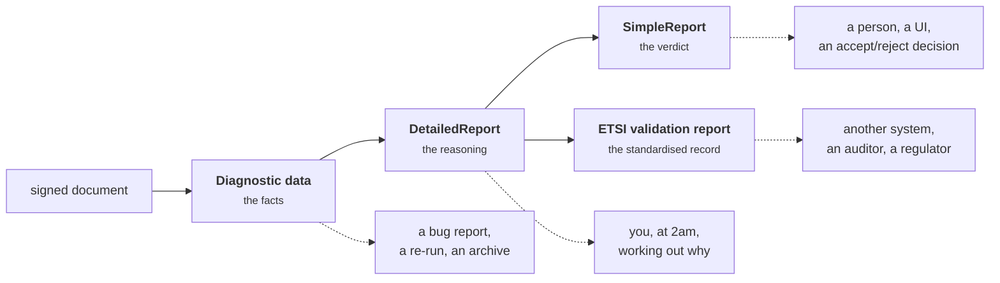

# The four reports

One call to `dss.Validate` produces four documents at once. They are not four
formats of the same thing — they are four **altitudes**, and each answers a
different question for a different reader.



The arrows are real: the engine builds diagnostic data from the document,
reasons over it to produce the detailed report, and derives the simple and ETSI
reports from that. Nothing appears in a higher report that is not backed by the
one below it.

## Which one do I read?

| | **SimpleReport** | **DetailedReport** | **Diagnostic data** | **ETSI validation report** |
|---|---|---|---|---|
| **Answers** | What is the verdict? | Why is that the verdict? | What did it have to work with? | What happened, in a standard form? |
| **Read by** | end users, UIs, dashboards | developers, support | developers, bug reports | other systems, auditors |
| **Standardised** | DSS schema | DSS schema | DSS schema | **ETSI TS 119 102-2** |
| **Accessor** | `reports.Verdicts()`, `reports.Valid()` | `reports.GetDetailedReport()` | `reports.GetDiagnosticData()` | `reports.GetEtsiValidationReportJaxb()` |
| **XML** | `reports.SimpleReportXML()` | `reports.DetailedReportXML()` | `reports.DiagnosticDataXML()` | `reports.ETSIValidationReportXML()` |
| **CLI** | `-format simple` | `-format detailed` | `-format diagnostic` | `-format etsi-vr` |

**If you are unsure: SimpleReport.** In Go you rarely touch even that — the
facade's `Verdicts()` reads it for you.

To give a sense of scale, the four renderings of one B-level PDF signature from
the repository's own test fixture came out at 26, 325, 133 and 175 lines
respectively. The ratio, not the absolute size, is the thing to notice.

## SimpleReport — the verdict

One block per signature: the indication, the sub-indication, the level, the
qualification, who signed, when, and the human-readable errors and warnings
behind the conclusion. This is what a user interface renders.

```xml
<Signature SignatureFormat="PAdES-BASELINE-B" Id="S-C2AE57DE…">
    <Indication>TOTAL_PASSED</Indication>
    <SigningTime>2026-08-21T15:26:45Z</SigningTime>
    <BestSignatureTime>2026-08-21T15:33:48Z</BestSignatureTime>
    <SignedBy>Go Port Test RSA</SignedBy>
    <SignatureLevel description="Not applicable">N/A</SignatureLevel>
    <SignatureScope name="Full PDF" scope="FULL">The document ByteRange : [0 959 19905 441]</SignatureScope>
</Signature>
```

!!! warning "Two things called 'level'"
    In the SimpleReport, `SignatureFormat` carries the format **and** the
    baseline level (`PAdES-BASELINE-B`), while the element named
    `<SignatureLevel>` carries the **eIDAS qualification** (`QESig`,
    `AdESig`, … or `N/A`). This is upstream's naming, kept as-is for schema
    compatibility. The facade avoids the trap: `Verdict.SignatureLevel` is the
    baseline level and `Verdict.Qualification` is the qualification.

Two other fields repay attention:

- **`SigningTime`** is *claimed* by the signer. **`BestSignatureTime`** is the
  earliest time the signature is *proven* to have existed. In the example above
  they differ, because a B-level signature has no time-stamp — so the best
  proven time falls back to the validation time. On a T-level signature,
  `BestSignatureTime` comes from the time-stamp and means something.
- **`SignatureScope`** says *what the signature actually covers*. On a PDF, "the
  whole document" versus "the first revision only" is the difference between a
  signature you can rely on and one someone has appended pages to.

In Go you get all of it through `reports.Verdicts()`:

```go
for _, v := range reports.Verdicts() {
    fmt.Println(v.ID, v.Indication, v.SubIndication, v.SignatureLevel, v.Qualification, v.SignedBy)
    for _, e := range v.Errors {
        fmt.Println("   error:", e.Value)
    }
}
```

There is a sibling for certificates rather than signatures — the
*SimpleCertificateReport*, produced when you validate a certificate instead of
a document.

## DetailedReport — the reasoning

Every building block, every individual check, every conclusion, arranged the
way [EN 319 102-1](validation.md) arranges them.

```xml
<ValidationProcessBasicSignature Title="Validation Process for Basic Signatures">
    <Constraint Id="S-C2AE…-FC">
        <Name Key="BSV_IFCRC">Is the result of the 'Format Checking' building block conclusive?</Name>
        <Status>OK</Status>
    </Constraint>
    <Constraint Id="S-C2AE…-XCV">
        <Name Key="BSV_IXCVRC">Is the result of the 'X.509 Certificate Validation' building block conclusive?</Name>
        <Status>OK</Status>
    </Constraint>
    <Conclusion><Indication>PASSED</Indication></Conclusion>
</ValidationProcessBasicSignature>
```

This is where you go when the SimpleReport says
<span class="verdict indeterminate">INDETERMINATE</span> and you need to know
which check, in which block, on which certificate, decided that. Every
`<Name Key="…">` is a stable message identifier — greppable, and the same
identifier Java DSS emits, which makes it the natural thing to compare when two
implementations disagree.

For a real signature this runs to hundreds of lines. That is the point: it is a
transcript, not a summary.

## Diagnostic data — the facts

Everything the engine *extracted* from the document before it reasoned about
anything: every signature and its properties, every certificate with its
extensions and validity dates, every CRL and OCSP response, every time-stamp,
every digest, the container structure.

Crucially, it contains **no conclusions**. It is the input, and it is
self-contained — which makes it the right thing to attach to a bug report, and
the right thing to archive. Given the same diagnostic data and the same policy,
the engine produces the same verdict, on either implementation. That property is
what this port's parity testing is built on; see
[Methodology](../compatibility/methodology.md).

Reach for it when you need a fact the reports do not surface — a certificate
extension, a specific digest value, the exact revocation response used.

## ETSI validation report — the standardised record

The report format defined by **ETSI TS 119 102-2**: a machine-readable record
of the validation, in a schema agreed across implementations rather than one
vendor's. If you are handing the outcome to another organisation's system, to
an auditor, or into a long-term archive, this is the artefact that will still
mean something when nobody remembers what DSS was.

## Getting at them

```go
reports, err := dss.Validate(doc, opts)
if err != nil {
    log.Fatal(err)
}

// The short answer.
fmt.Println(reports.Valid(), reports.SignatureCount(), reports.ValidSignatureCount())

// XML, identical in schema to what Java DSS emits.
xml, err := reports.SimpleReportXML()

// The full upstream API is embedded, not hidden.
detailed := reports.GetDetailedReport()
diagnostic := reports.GetDiagnosticData()
```

`dss.Reports` embeds the port's `validation/reports.Reports`, so every accessor
upstream offers is available; the facade adds convenience, it does not wrap
anything away. Field-by-field reference:
[pkg.go.dev](https://pkg.go.dev/github.com/utain/esig/dss#Reports).

From the CLI, each report renders directly, and a saved SimpleReport can be
turned back into the human summary later:

```sh
esig validate contract.pdf -trust ca.cer -format detailed -out detailed.xml
esig validate contract.pdf -trust ca.cer -format simple    -out simple.xml
esig report simple.xml -render
```

## A rule of thumb for what to keep

Storing validation outcomes? Keep **the diagnostic data and the ETSI validation
report**. The first lets you re-run the decision with a later policy; the second
is the durable, standard-shaped record of the decision you actually made. The
SimpleReport is cheap to regenerate from either.

## Next

- [How validation works](validation.md) — what the DetailedReport is a
  transcript *of*.
- [Verifying Java DSS interop](../guides/verifying-java-dss-interop.md) — using
  these reports to compare two implementations.
