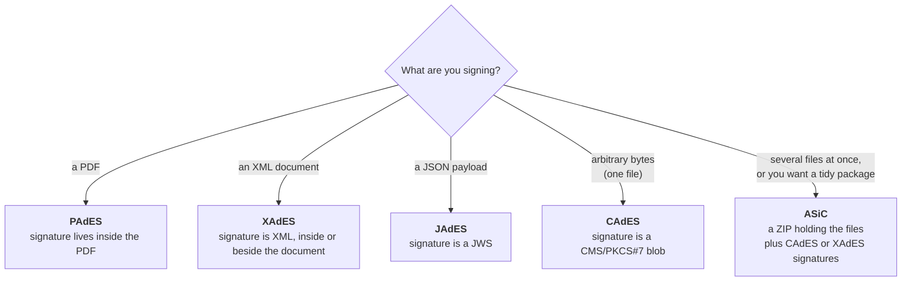
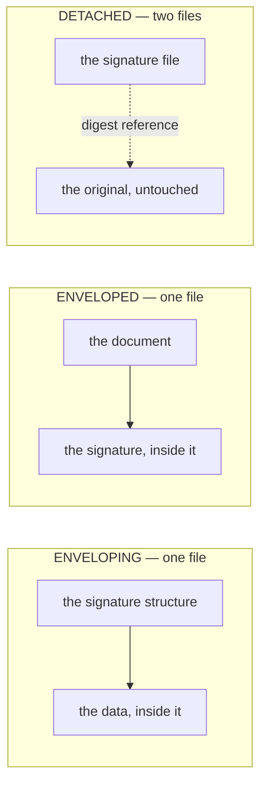

# Signature formats

**CAdES, XAdES, PAdES, JAdES, ASiC.** Five names for what is, underneath, the
same idea: take a cryptographic signature, and wrap it in a structure that also
records *who* signed, *when*, *with which certificate*, and *what evidence a
verifier will need later*. The five differ almost entirely in what that
structure is made of — and that is decided by what you are signing.

## The one-minute version

If someone has told you which format to produce — a tax authority, an
e-invoicing scheme, a national eID profile — use that. The choice is usually
made by the receiving system, not by you.

## The decision table

| | **CAdES** | **XAdES** | **PAdES** | **JAdES** | **ASiC** |
|---|---|---|---|---|---|
| **Signs** | any bytes | XML | PDF | JSON / any bytes | any set of files |
| **Signature is** | a CMS `SignedData` (ASN.1/DER) | an XML `<ds:Signature>` element | a CMS blob embedded in the PDF | a JWS (JOSE) | a ZIP container holding CAdES or XAdES signatures |
| **Result is still openable by ordinary tools** | no — signature is separate or wraps the data | yes, if enveloped | **yes** — still a valid PDF, opens in any reader | depends on serialization | yes — it is a ZIP |
| **Signature visible to a human** | no | no | in a PDF reader, yes | no | no |
| **Multiple signers** | yes | yes | yes (one per incremental update) | yes (JSON serialization) | yes |
| **Several files under one signature** | no | no (references can, but awkwardly) | no | no | **yes — this is the point** |
| **Base standard** | ETSI EN 319 122 | ETSI EN 319 132 | ETSI EN 319 142 | ETSI TS 119 182 | ETSI EN 319 162 |
| **Facade constant** | `dss.FormatCAdES` | `dss.FormatXAdES` | `dss.FormatPAdES` | `dss.FormatJAdES` | `dss.FormatASiCWithCAdES` / `dss.FormatASiCWithXAdES` |
| **CLI `-format`** | `cades` | `xades` | `pades` | `jades` | `asice` / `asics` |

All five are supported by this port for **signing, extending and validating**,
at every baseline level. See [Signature levels](signature-levels.md).

## Packaging: where the signature sits relative to the data

For CAdES, XAdES and JAdES you also choose a *packaging*. This trips people up
more often than the format choice does.

- **Enveloping** — the signature structure *contains* the data. One file comes
  out; the data is inside it. Anyone reading it needs a tool that understands
  the signature format.
- **Enveloped** — the data structure *contains* the signature. The XML invoice
  is still an XML invoice, with a `<ds:Signature>` element added inside it. This
  is the usual shape for signed XML business documents.
- **Detached** — two files: the original, untouched, and a signature file
  beside it. Neither is useful without the other, and a validator must be
  *given* the original — which is what `ValidateOptions.DetachedContents` and
  the CLI's `-detached` flag are for.

PAdES has no such choice: a PDF signature is always embedded, in an incremental
update appended to the file. ASiC has no such choice either: the container
decides.

Facade defaults, when you do not set `SignOptions.Packaging`: enveloped for
XAdES, enveloping for CAdES and JAdES.

## The formats in a little more depth

### CAdES — bytes

**C** is for CMS. The signature is a `SignedData` structure from
[RFC 5652](https://www.rfc-editor.org/rfc/rfc5652) — the same family as the old
PKCS#7 — carrying the signature value, the signing certificate, and a set of
*signed attributes* (the signing time, a digest of the certificate, the content
type). CAdES adds the attributes that make a signature durable: time-stamps,
certificate and revocation values, archive time-stamps.

Use it when the thing being signed is just data and there is no format-native
place to put a signature. It is also the substrate for PAdES and for ASiC-CAdES.

### XAdES — XML

The signature is XMLDSig (`<ds:Signature>`) with an ETSI-defined
`<xades:QualifyingProperties>` block hanging off it. Its distinguishing
difficulty is **canonicalization**: XML that means the same thing can be
spelled many ways (attribute order, namespace declarations, whitespace), so
before hashing, the document is rewritten into a canonical form. Get that byte
sequence wrong by one space and the signature does not verify. This port
implements all seven canonicalization algorithms the upstream stack registers
and checks them against Java's answers — see [The numbers](../compatibility/numbers.md).

### PAdES — PDF

A CAdES signature, embedded in the PDF's own object structure, covering a
**byte range** of the file: everything except the hole where the signature
itself is written. Signing appends an *incremental update* rather than
rewriting the file, so earlier revisions stay intact and a validator can tell
exactly what each signature covered and what changed afterwards.

This is why PAdES is the format people meet first — the signed file is still an
ordinary PDF, and readers show the signature panel.

!!! warning "No visible appearances"
    This port creates the signature field and its rectangle but does not paint
    anything into it: there is no rasteriser or font engine in the native PDF
    engine, so image and text appearances are not supported. See
    [Known gaps](../compatibility/known-gaps.md).

### JAdES — JSON

The JOSE family: the signature is a JWS, either compact
(`header.payload.signature`), JSON-serialized, or flattened JSON. The AdES
properties live in JOSE header parameters. Compact serialization cannot carry a
detached payload or several signatures, so those need one of the JSON
serializations — `SignOptions.JWSSerialization` selects which.

### ASiC — a container of things

Associated Signature Container. It is a ZIP with rules: a `mimetype` entry
first and uncompressed, a `META-INF/` directory holding the signatures, and —
for the extended flavour — manifests binding each signature to what it covers.

Two flavours:

- **ASiC-S** (*simple*) — one signed data object. The container is a wrapper.
- **ASiC-E** (*extended*) — many signed data objects, each described by a
  manifest. This is what you use when a submission is "a form, three
  attachments and a covering letter" and all of it must be signed as a unit.

Inside, the signatures are either CAdES or XAdES; `dss.FormatASiCWithCAdES` and
`dss.FormatASiCWithXAdES` choose which, and `SignOptions.ContainerType` chooses
S or E. See [ASiC containers](../guides/containers-asic.md).

## Choosing, in practice

1. **Is the format prescribed?** By a scheme, a regulator, the receiving
   system? Then it is decided. This is the common case.
2. **Is the artefact a PDF?** PAdES. The signature travels with the document and
   humans can see it.
3. **Is it XML that a downstream system parses?** XAdES, enveloped.
4. **Is it JSON on an API boundary?** JAdES.
5. **Is it several files that must be signed as one submission?** ASiC-E.
6. **Otherwise** — CAdES detached, and keep the two files together.

## Next

- [Signature levels](signature-levels.md) — B, T, LT, LTA, and how long the
  signature has to survive.
- [Sign a PDF](../guides/sign-a-pdf.md).
- [ASiC containers](../guides/containers-asic.md).
