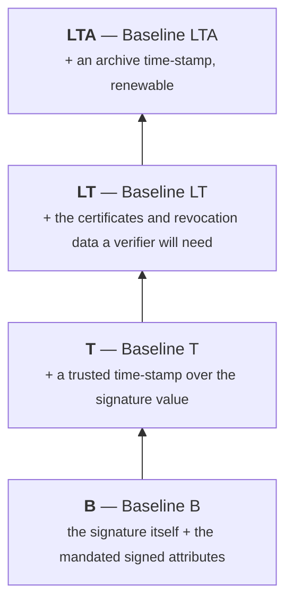
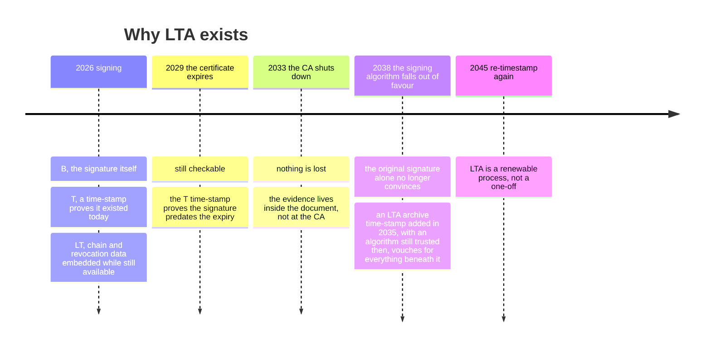

# Signature levels

**B, T, LT, LTA.** The format decides *what shape* the signature has. The level
decides *how long it stays checkable*.

Every level contains the one below it. You do not choose between them so much
as choose how far up the stack to go — and you can climb later, without the
signing key, by *extending* an existing signature.



## The problem every level above B is solving

A signature is checked with the signer's public key, which comes in a
certificate, which is only meaningful while it is valid and not revoked.
Certificates expire — typically in one to three years. Keys get compromised and
certificates get revoked. Hash functions and key sizes weaken over decades.

So a signature that was perfectly good when it was made can become
**uncheckable** later, not because anything is wrong with it but because the
evidence needed to check it has evaporated:

- the certificate has expired, and nothing records that it had not expired *at
  the moment of signing*;
- the CA's revocation information for that period is no longer published
  anywhere;
- the digest algorithm has since been broken.

Each level above B closes one of those holes, **at signing time**, because none
of them can be closed afterwards.

## What each level actually adds

=== "B — Baseline B"

    The signature value plus the signed attributes the ETSI baseline profile
    mandates: which certificate signed, what the content type is, the claimed
    signing time.

    **Trust it for:** integrity and origin, *right now*, while the certificate
    is still valid and you can still reach the CA's revocation data.

    **Note the claimed signing time is claimed.** It is a value the signer put
    in, signed by the signer. Nothing independent vouches for it. If the
    question "was this signed before the deadline?" matters, B is not enough.

    ```go
    dss.SignOptions{Format: dss.FormatPAdES, Level: dss.LevelB}
    ```

=== "T — Baseline T"

    B, plus a **signature time-stamp**: an RFC 3161 token from a time-stamping
    authority, over the signature value.

    That token is the independent proof that the signature *existed* at that
    moment — which is what lets a verifier, years later, ask "was the
    certificate valid *then*?" instead of "is it valid *now*?".

    **Requires** a `TSPSource`. See
    [Timestamps and TSAs](../guides/timestamps-and-tsas.md).

    ```go
    dss.SignOptions{Format: dss.FormatPAdES, Level: dss.LevelT, TSPSource: tsa}
    ```

=== "LT — Baseline LT"

    T, plus the **validation material** embedded in the signature: the
    certificate chain, and the CRLs or OCSP responses proving those
    certificates were not revoked.

    Now the signature is self-contained. A verifier in 2040 does not have to
    find a CA that stopped operating in 2029 — the evidence travels inside the
    document.

    **Requires** a `TSPSource` *and* revocation sources on a
    `CertificateVerifier`, because the library has to actually fetch that
    material in order to embed it. The library ships no HTTP CRL/OCSP client
    (see [Known gaps](../compatibility/known-gaps.md)), so you supply one.

=== "LTA — Baseline LTA"

    LT, plus an **archive time-stamp** covering the signature *and* all that
    embedded validation material.

    This is the level that survives cryptographic ageing. Before the algorithms
    protecting the existing time-stamps become weak, you add another archive
    time-stamp — with today's stronger algorithms — over everything that is
    already there. The chain of time-stamps carries the proof forward
    indefinitely, each link vouching for the one before it while both are still
    strong.

    **Requires** a `TSPSource`, and — because LTA builds on LT — the revocation
    material too.

## The lifecycle, over years



The key idea is that an archive time-stamp is not a one-time act. **LTA is a
maintenance commitment**: someone has to add another archive time-stamp before
the current ones weaken. If nobody will, LT is the honest level to stop at.

## Choosing a level

| Question | Level |
|---|---|
| Checked within days, by someone who can reach the CA, and the timing does not matter? | **B** |
| Does *when* it was signed matter — deadlines, precedence, expiry? | **T** |
| Will it be checked after the signing certificate expires, or after the CA may be gone? | **LT** |
| Must it hold up for a decade or more, and someone will maintain it? | **LTA** |

For anything archival — contracts, invoices, public records — **LT is the
sensible floor**, and LTA if you have an archive process. For an API request
signature checked seconds later, B is right and anything more is cost with no
benefit.

## Extending: climbing the stack later

Levels can be added after the fact. Extension does not need the signing key —
it only adds time-stamps and validation data *around* the existing signature
value.

```go
extended, err := dss.Extend(signed, dss.ExtendOptions{
    Format:    dss.FormatPAdES,
    Level:     dss.LevelT,
    TSPSource: tsa,
})
```

or, without writing any Go:

```sh
esig extend contract-signed.pdf -format pades -level T -tsa https://tsa.example/tsa
```

This is how an archive keeps documents alive: ingest at B or T, extend to LT on
receipt, and re-timestamp to LTA on a schedule.

!!! note "Extension is not free of prerequisites"
    You cannot extend to LT without being able to fetch revocation data for the
    signing chain, and if that data is already gone, it is gone. Extending
    *early* is the whole point.

## What the reports tell you

Validation reports the level the signature **is**, not the level it should have
been: `Verdict.SignatureLevel` renders as e.g. `PAdES-BASELINE-B` or
`XAdES-BASELINE-LTA`. A document claiming to be archival that reports
`-BASELINE-B` is a finding.

Separately, `ValidateOptions.Level` controls how far the *validation process*
goes — basic signatures, time-stamps, long-term data, or archival data. It
defaults to the fullest. See [How validation works](validation.md).

## Next

- [Timestamps and TSAs](../guides/timestamps-and-tsas.md) — the practical part
  of everything above B.
- [How validation works](validation.md) — what the levels buy you at
  verification time.
