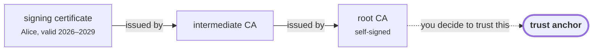
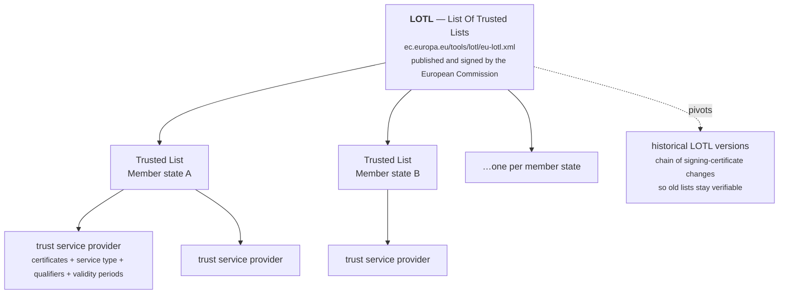

# Trust, eIDAS and qualification

Cryptography can prove that a document was signed by whoever holds a particular
private key. It cannot tell you **who that is**, or **whether anyone official
vouches for them**. That second question is what this page is about, and it is
where most of the complexity of European digital signatures lives.

## Chains and trust anchors

A signature carries a certificate. That certificate is itself signed by a
certificate authority, whose certificate may be signed by another, up to a
**root** that is self-signed and signed by nobody.



Following that chain is mechanical. Deciding to **believe** the root is not — it
is a policy decision made by a human, once, and encoded as a *trust anchor*.
Without one, the chain terminates in a certificate nobody vouches for, and the
verdict is `INDETERMINATE (NO_CERTIFICATE_CHAIN_FOUND)`.

Supplying anchors, at its simplest:

```go
ca, err := dss.LoadCertificate("root-ca.cer")
reports, err := dss.Validate(doc, dss.ValidateOptions{
    TrustedCertificates: []*dss.CertificateToken{ca},
})
```

```sh
esig validate contract.pdf -trust root-ca.cer
```

Along the way the engine also checks each certificate was not **revoked** —
withdrawn by its issuer before its expiry date, because the key was lost or the
holder's authority ended. Revocation status comes from CRLs (a published list
of revoked serial numbers) or OCSP (a live query per certificate). This is why
[level LT](signature-levels.md) embeds that material: it is available now and
may not be in ten years.

## The EU trusted lists

Trusting one root is easy. Trusting **every certificate authority that any of
the 27 EU member states has recognised as qualified** — that is the problem the
trusted-list machinery solves.



A **Trusted List** is a signed XML document in which a member state's
supervisory body publishes the trust service providers it has recognised: their
certificates, what kind of service each provides (certificates for signatures,
for seals, time-stamping), the *qualifiers* attached, and — crucially — the
periods during which each status held. A trusted list is history, not just a
snapshot: it records that a provider was qualified from 2019 to 2023 and
withdrawn thereafter, which is exactly what you need to judge a signature made
in 2021.

The **LOTL** is the list of those lists, signed by the Commission. Trust the
LOTL's signing certificates, and you transitively obtain everything else.

**Pivots** exist because the LOTL's own signing certificates change over time.
A pivot is a historical snapshot of the LOTL at the moment of such a change, so
that a chain of pivots lets you verify an old LOTL from a current trust anchor
without a gap.

**MRA** — Mutual Recognition Agreement — is the mechanism by which a
non-EU scheme's trust services can be mapped onto EU qualification, where an
agreement exists. The port parses and applies MRA information; it is not
something you configure per call.

### Using them

The `tsl` package's `TLValidationJob` downloads the LOTL, follows it to every
member state list, validates the signatures, and builds a
`TrustedListsCertificateSource` — a trust store that carries not only
certificates but the trusted-list *information attached to them*. That extra
information is what makes qualification determination possible.

```go
reports, err := dss.Validate(doc, dss.ValidateOptions{
    TrustedCertificateSources: []dss.CertificateSource{trustedListSource},
})
```

Or, from the CLI, refresh a cache once and point validations at it:

```sh
esig tl refresh -cache ./tl-cache -lotl-cert lotl-signing.cer
esig validate contract.pdf -tl-cache ./tl-cache
```

!!! warning "The CLI cache carries anchors, not qualifiers"
    `esig tl refresh` writes the collected certificates as PEM files, and
    nothing else. That anchors chains — the indication becomes meaningful — but
    the qualification still reads `NA`, because which trust service qualifies
    which certificate is not in a PEM file. A **qualification verdict needs the
    in-memory `TrustedListsCertificateSource`** the job produces, passed to
    `ValidateOptions.TrustedCertificateSources` from Go.

The full walkthrough, including what to do offline and how often to refresh, is
in [Validate against the EU trusted lists](../guides/validate-against-eu-trusted-lists.md).

!!! note "A plain trust store cannot produce a qualification"
    `dss.TrustStore(certs...)` anchors chains, and that is all it does. It
    carries no trusted-list information, so the qualification comes back `NA`.
    That is not a bug — `NA` means *the question could not be answered*, not
    *not qualified*.

## AdES, QES, and the words in between

Two independent questions are constantly conflated:

1. **Does the signature verify?** → the [indication](validation.md).
2. **What legal weight does it carry under eIDAS?** → the **qualification**.

The eIDAS regulation defines a ladder:

| Term | What it means |
|---|---|
| **Electronic signature** | Any data attached to other data to sign it. No technical bar at all. |
| **AdES** — advanced electronic signature | Uniquely linked to the signer, capable of identifying them, created with means under their sole control, and detecting any subsequent change. This is what CAdES/XAdES/PAdES/JAdES *are*. |
| **AdES/QC** | An AdES supported by a **qualified certificate** — one issued by a provider a member state has recognised as qualified for that purpose. |
| **QES** — qualified electronic signature | An AdES/QC whose private key lives in a **QSCD**, a qualified signature creation device (a certified smart card or HSM). Under eIDAS this has the legal effect of a handwritten signature across the EU. |

Two orthogonal distinctions ride alongside:

- **Signature vs. seal.** A *signature* belongs to a natural person; a *seal*
  belongs to a legal person, an organisation. Same machinery, different legal
  meaning. Hence `QESig` and `QESeal`.
- **Signature vs. website certificate.** A **QWAC** is a qualified certificate
  for website authentication — TLS, not document signing. The port handles the
  qualification of these too; it is a different question from either of the
  above.

The values you will see in `Verdict.Qualification` (from the port's
`SignatureQualification` enumeration, rendered here the way the reports print
them):

| Value | Reading |
|---|---|
| `QESig` / `QESeal` | Qualified electronic signature / seal. The top of the ladder. |
| `AdESig-QC` / `AdESeal-QC` | Advanced, on a qualified certificate — but not established to be on a QSCD. |
| `AdESig` / `AdESeal` | Advanced. No qualified certificate. |
| `Not AdES`, `Not AdES but QC`, `Not AdES but QC with QSCD` | Does not meet the advanced-signature requirements, whatever the certificate is. |
| `Unknown`, `Unknown-QC`, `Unknown-QC-QSCD` | The certificate type could not be determined. |
| `Indeterminate …` variants of all of the above | The trusted-list information was insufficient to settle it. |
| `N/A` (enum value `NA`, which is what the CLI prints) | Not applicable — no trusted-list information was supplied at all. |

!!! warning "Qualification is not validity"
    They are independent. A `QESig` can still be
    <span class="verdict fail">TOTAL_FAILED</span> if the document was altered
    afterwards. An `NA` signature can be perfectly
    <span class="verdict pass">TOTAL_PASSED</span> against your own private
    trust anchor. **Read both.**

## Time-stamps have qualification too

The same ladder applies to time-stamping. A token from a **QTSA** — a qualified
trust service provider for time-stamps — carries a legal presumption of
accuracy that a token from any other TSA does not. That is reported separately,
in `TimestampVerdict.Qualification`.

If your reason for time-stamping is legal rather than technical, the TSA being
qualified is the whole point. See
[Timestamps and TSAs](../guides/timestamps-and-tsas.md).

## What to actually do

- **Internal documents, your own PKI.** Load your root as a trust anchor. Ignore
  qualification; it will be `NA` and that is correct.
- **Documents from EU counterparties, and the legal weight matters.** Run the
  TSL job, pass the resulting source, and read both the indication and the
  qualification.
- **You are producing signatures that must be qualified.** That is decided by
  your certificate and your device, not by this library. You need a qualified
  certificate from a qualified provider and a QSCD holding the key. The library
  will faithfully sign with whatever key you give it; it cannot make an ordinary
  key qualified.

## Next

- [Validate against the EU trusted lists](../guides/validate-against-eu-trusted-lists.md) — the practical version.
- [The four reports](reports.md) — where qualification appears and what backs it.
