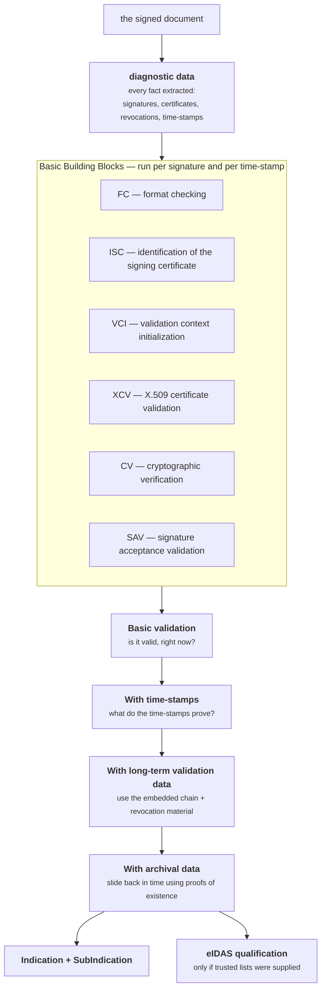

# How validation works

Ask this library whether a signature is valid and it does not answer *yes* or
*no*. It answers with an **indication** — one of three — plus a
**sub-indication** saying why, plus a full audit trail of every check it ran.

That is not the library being coy. It reflects a real distinction that a
boolean cannot carry.

## The three answers

<div class="esig-cards" markdown>

<div markdown>
### <span class="verdict pass">TOTAL_PASSED</span>
Everything checked out. The cryptography verifies, the certificate chain
reaches a trust anchor you named, nothing was revoked at the relevant time, and
the signature satisfies the policy.
</div>

<div markdown>
### <span class="verdict fail">TOTAL_FAILED</span>
Something is definitively wrong. The bytes were altered, the signature does not
verify against the key, or the certificate was revoked before the signature
existed. **Do not accept this document.**
</div>

<div markdown>
### <span class="verdict indeterminate">INDETERMINATE</span>
The available information is not sufficient to decide. Nothing is *wrong*; you
just cannot conclude. Usually: no trust anchor, no revocation data, or a
time-stamp missing that would have proven when the signature existed.
</div>

</div>

**INDETERMINATE is the one that matters.** It is by far the most common result
in practice, and it is a *question*, not a verdict: it says "give me more, or
tell me what to trust, and I will decide." The sub-indication tells you exactly
what is missing.

The most common one you will meet on day one:

```
INDETERMINATE (NO_CERTIFICATE_CHAIN_FOUND)
    The certificate chain for signature is not trusted, it does not contain a trust anchor.
```

You did not tell it what to trust. Supply trust anchors — see
[Trust, eIDAS and qualification](trust-and-eidas.md).

Other sub-indications you will meet often:

| Sub-indication | In plain language |
|---|---|
| `NO_CERTIFICATE_CHAIN_FOUND` | Nothing anchors the chain. Supply trust anchors. |
| `NO_SIGNING_CERTIFICATE_FOUND` | The signing certificate is not in the document and was not supplied. |
| `TRY_LATER` | Revocation data is not fresh enough yet. Come back later, or relax the freshness constraint. |
| `REVOKED_NO_POE` | The certificate is revoked, and there is no proof the signature existed before the revocation. A time-stamp (level T) would have settled this. |
| `OUT_OF_BOUNDS_NO_POE` | The certificate had expired, and nothing proves the signature predates the expiry. Again: level T. |
| `CRYPTO_CONSTRAINTS_FAILURE_NO_POE` | An algorithm used is no longer acceptable, and nothing proves the signature was made while it still was. |
| `SIGNED_DATA_NOT_FOUND` | A detached signature, and you did not supply the original file. |
| `HASH_FAILURE` | <span class="verdict fail">FAILED</span>, not indeterminate — the data does not match the digest. It was altered. |
| `SIG_CRYPTO_FAILURE` | <span class="verdict fail">FAILED</span> — the signature does not verify against the public key. |

Notice how many of those end in `_NO_POE`. **POE** is *proof of existence* —
evidence that something existed at a particular time, which in practice means a
time-stamp. Half of the indeterminate outcomes in the world are "I would know
the answer if there were a time-stamp here", which is exactly the argument for
[level T and above](signature-levels.md).

## The shape of the process

The standard behind all this is **ETSI EN 319 102-1**. Its structure, which
this port implements one for one, is: small reusable *building blocks*, wired
into *processes* of increasing thoroughness.



### The building blocks

Each is a chain of individual checks, each with its own conclusion, all of which
end up in the [DetailedReport](reports.md).

| Block | The question it answers |
|---|---|
| **FC** — format checking | Is this a well-formed signature of the format and level it claims to be? |
| **ISC** — identification of the signing certificate | Which certificate signed this, and can we actually find it? |
| **VCI** — validation context initialization | Which policy applies, and does the signature reference one we must honour? |
| **XCV** — X.509 certificate validation | Does the chain build to a trust anchor? Was every certificate in it valid and unrevoked at the relevant time? |
| **CV** — cryptographic verification | Do the digests match and does the signature verify against the public key? |
| **SAV** — signature acceptance validation | Are the signed attributes and the algorithms used acceptable under the policy? |

Two more run inside the archival process: **past certificate validation** and
**validation time sliding**, which are how the engine reasons backwards in time.

### The processes

Each process consumes the one before it and adds evidence:

1. **Basic signature validation** — the building blocks, evaluated at the
   current time. If everything is present and good, this alone yields
   <span class="verdict pass">TOTAL_PASSED</span>.
2. **Validation with time-stamps** — validate the time-stamp tokens themselves,
   establishing the *best signature time*: the earliest moment the signature is
   proven to have existed.
3. **Validation with long-term validation data** — use the certificates and
   revocation material embedded in the signature (level LT), so the answer no
   longer depends on the CA still being reachable.
4. **Validation with archival data** — the full process. Using proofs of
   existence from the time-stamp chain, *slide the validation time backwards*
   to a moment where the evidence was good, and conclude from there. This is how
   a correctly-built LTA signature still passes long after its certificate has
   expired.

`ValidateOptions.Level` chooses how far to go; it defaults to the fullest.
Stopping earlier is a performance choice, not a correctness one — a signature
that only passes at the archival level genuinely needs the archival level.

## Validation time: "valid" is always "valid *when*?"

Every answer above is relative to a moment. By default that is *now*, but you
can pin it:

```go
at := time.Date(2025, 3, 1, 0, 0, 0, 0, time.UTC)
reports, err := dss.Validate(doc, dss.ValidateOptions{
    ValidationTime:      &at,
    TrustedCertificates: anchors,
})
```

```sh
esig validate contract.pdf -at 2025-03-01T00:00:00Z -trust ca.cer
```

This is how you answer "was this acceptable at the time we relied on it?" —
a different, and often more useful, question than "is it acceptable today?".

## The policy: where the thresholds live

None of the acceptability decisions above are hard-coded. Which digest
algorithms are allowed, which key sizes, how fresh revocation data must be, how
long after signing a time-stamp may arrive, whether a missing signing time is
fatal or merely a warning — all of it is a **validation policy**: an XML
constraint document.

The library ships the ETSI policy and uses it by default. Supplying your own is
one option field. See [A custom validation policy](../guides/custom-validation-policy.md).

The reason this matters for reading verdicts: a
<span class="verdict indeterminate">INDETERMINATE</span> is often a policy
outcome rather than a cryptographic one. `CRYPTO_CONSTRAINTS_FAILURE` does not
mean "broken", it means "not acceptable under the rules you gave me".

## What comes back

`dss.Validate` returns four reports at once. The short summary most code wants:

```go
reports, err := dss.Validate(doc, opts)
if err != nil {
    // The validation could not RUN — unreadable document, unknown format,
    // broken policy. This is not a verdict.
}
for _, v := range reports.Verdicts() {
    fmt.Println(v.ID, v.Indication, v.SubIndication, v.Qualification)
    for _, e := range v.Errors {
        fmt.Println("   ", e.Value)
    }
}
```

!!! important "An error is not a verdict"
    `dss.Validate` returns a non-nil `error` only when validation could not be
    *performed*. A signature that fails is not an error — it is a result. Code
    that treats `err != nil` as "invalid" and `err == nil` as "valid" is wrong
    in both directions.

The full story lives in the four reports — see [The four reports](reports.md).

## Next

- [Trust, eIDAS and qualification](trust-and-eidas.md) — how to stop getting
  `NO_CERTIFICATE_CHAIN_FOUND`.
- [The four reports](reports.md) — which report answers which question.
- [Compatibility](../compatibility/methodology.md) — how this port's verdicts
  are held to Java DSS's.
