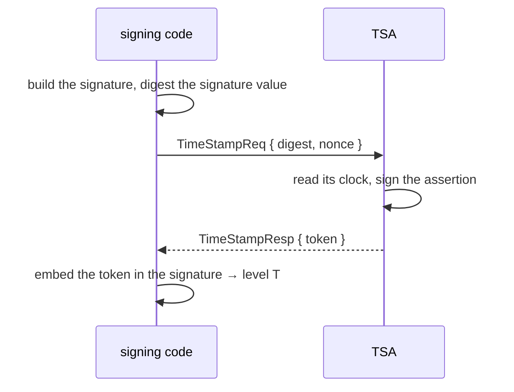
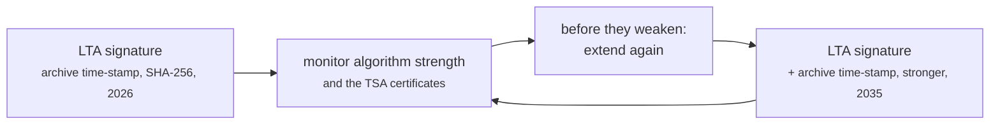

# Timestamps and TSAs

Everything above [level B](../concepts/signature-levels.md) needs a
time-stamp, and a time-stamp has to come from somewhere. This page is about
that "somewhere".

## What a time-stamp is, and is not

A **time-stamp token** is an RFC 3161 structure in which a third party — a
Time-Stamping Authority — asserts that it saw a particular digest at a
particular moment, and signs that assertion. It says nothing about *what* the
digest was of, or whether whatever it was is any good. It says only: *this
existed by then.*

That is exactly the missing piece in most `INDETERMINATE` verdicts. "The
certificate had expired" stops mattering once something independent proves the
signature predates the expiry. "The certificate was revoked" stops mattering
once something proves the signature predates the revocation. Half the
sub-indications in the standard end in `_NO_POE` — *no proof of existence* — and
a time-stamp is that proof.



Note what does **not** travel: the TSA never sees your document, only a digest
of the signature value. Time-stamping does not disclose content.

## What this port ships, and what it does not

Upstream's `dss-service` module — `OnlineTSPSource`, `OnlineCRLSource`,
`OnlineOCSPSource` — is **not part of this port**. That is a deliberate scope
line, not an oversight, and it has three consequences:

| | Available? |
|---|---|
| A `TSPSource` interface the signing services drive | **Yes** — implement it however you like |
| A local, key-based TSA (`spi/validation.KeyEntityTSPSource`) | **Yes** — issues real RFC 3161 tokens from a key you hold |
| An HTTP RFC 3161 client **in the library** | **No** |
| An HTTP RFC 3161 client **in the `esig` CLI** | **Yes** — `-tsa <url>` |
| HTTP CRL / OCSP clients | **No** — supply your own sources |
| Downloading trusted lists, fetching issuer certificates over AIA | **Yes** — those loaders are in `dss-spi` upstream and were ported |

The upshot: **the library never reaches the network unless you hand it
something that does.** For a cryptographic library that is a feature.

## Option 1 — the CLI's built-in client

Simplest, if a command line will do:

```sh
esig sign contract.pdf -format pades -level T \
    -p12 keystore.p12 -p12-pass env:P12PASS \
    -tsa https://tsa.example.org/tsa
```

and the same flag on `extend`:

```sh
esig extend contract-signed.pdf -format pades -level LTA \
    -tsa https://tsa.example.org/tsa
```

The CLI's client is a plain RFC 3161 request/response over HTTP, written on the
standard library. It lives in the CLI precisely so that the library keeps its
no-network promise.

## Option 2 — your own `TSPSource`

From Go, `TSPSource` is a small interface. Implement it against your TSA — with
whatever authentication, retry policy, proxy and timeout your environment
demands — and pass it in:

```go
signed, err := dss.Sign(doc, signer, dss.SignOptions{
	Format:    dss.FormatPAdES,
	Level:     dss.LevelT,
	TSPSource: myTSA, // anything implementing dss.TSPSource
})
```

This is the intended production route. The reason the library does not do it
for you is that "how do I talk to my TSA" is an operational question — mutual
TLS, an API key, an egress proxy — with no good default.

The CLI's implementation (`dss/cmd/esig/tsa.go`) is a readable, dependency-free
starting point if you want to copy one.

## Option 3 — a local key as a TSA

For tests, for development, and for genuinely self-hosted time-stamping, the
port ships `KeyEntityTSPSource`: it issues real RFC 3161 tokens signed by a key
you hold.

```go
import spivalidation "github.com/ryftcore/dss-go/dss/spi/validation"

tsa, err := spivalidation.NewKeyEntityTSPSourceFromKeyStorePath(
	"tsa.p12", "PKCS12", "password", "", "password")
if err != nil {
	log.Fatal(err)
}
tsa.SetTsaPolicy("1.2.3.4.5.6.7.8.9") // your TSA policy OID
```

This is what every example and test in the repository uses, which is why they
all run offline.

!!! warning "A self-issued time-stamp proves nothing to anyone else"
    The value of a time-stamp is that an *independent* party asserted the time.
    A token you signed yourself is worth exactly what your own claim is worth.
    Fine for tests; not a substitute for a TSA in production.

## Choosing a TSA

Practical criteria, roughly in order:

1. **Does it need to be qualified?** If the legal weight matters under eIDAS,
   the TSA must be a *qualified* trust service provider for time-stamps, listed
   in an EU trusted list. Then — and only then — validation reports a `QTSA`
   time-stamp qualification. See
   [Trust, eIDAS and qualification](../concepts/trust-and-eidas.md).
2. **Will it still exist in ten years?** For LTA you will be coming back
   repeatedly. A TSA that disappears does not invalidate old tokens, but it does
   mean finding another one.
3. **Digest algorithms and token lifetime.** The TSA's own certificate has an
   expiry, and its algorithm choices age like everything else.
4. **Rate limits and cost.** Bulk signing means one round trip per signature.

## Renewing: the LTA maintenance loop

An archive time-stamp is not a one-time act. The pattern:



Each new archive time-stamp covers everything already present, including the
previous time-stamps, so the chain of proof stays unbroken even as individual
links age out.

```go
renewed, err := dss.Extend(archived, dss.ExtendOptions{
	Format:    dss.FormatPAdES,
	Level:     dss.LevelLTA,
	TSPSource: tsa,
})
```

If nobody in your organisation will own that loop, be honest and stop at LT.

## Troubleshooting

**`ErrTSPSourceRequired`.** You asked for T, LT or LTA without a `TSPSource`.
Levels above B are not achievable without one — that is the definition, not a
limitation.

**The time-stamp validates as INDETERMINATE.** The TSA's own certificate chain
needs a trust anchor too. A time-stamp is a signature; it gets validated like
one.

**Level LT fails to collect revocation data.** LT embeds CRLs or OCSP
responses, which someone has to fetch. Set the sources on a
`CertificateVerifier` and pass it in `SignOptions.CertificateVerifier`; the
alert policy on that verifier decides whether an incomplete collection is fatal
or a warning.

## Next

- [Signature levels](../concepts/signature-levels.md) — what each time-stamp buys.
- [Sign a PDF](sign-a-pdf.md).
