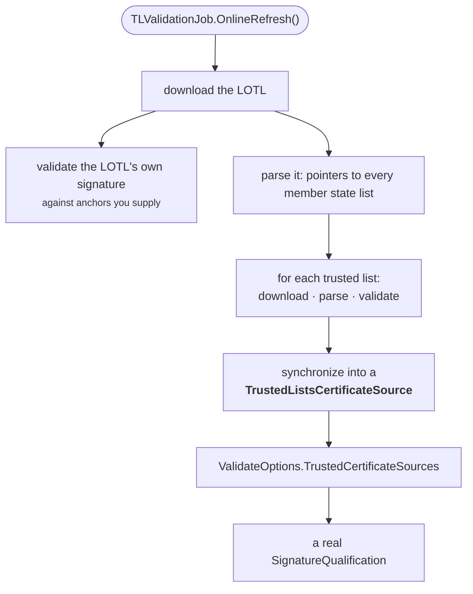

# Validate against the EU trusted lists

This is the guide that turns *"the signature verifies"* into *"the signature is
eIDAS qualified"*. If you need to accept documents from counterparties across
the EU and know what legal weight they carry, this is the machinery.

Read [Trust, eIDAS and qualification](../concepts/trust-and-eidas.md) first for
what a trusted list *is*; this page is the how.

## The shape of the job



Two things to internalise before writing any code:

- **It is a lot of network traffic.** The LOTL plus 27-odd member state lists —
  easily a hundred requests. This is something you run on a schedule and cache,
  not per validation.
- **Failure is a cache state, not an exception.** `OnlineRefresh` does not
  return an error because one country's server is down. It records the failure
  against that list and carries on. Only a misconfiguration — no data loader,
  say — is a returned error. Check the per-list statuses in the summary.

## From the CLI

The quick path: refresh into a directory, then validate against it.

```sh
esig tl refresh -cache ./tl-cache -lotl-cert lotl-signing.cer
```

It prints a per-list summary — how many lists were processed, each one's URL and
cache status (with its indication and sub-indication where it was validated),
how many certificates were synchronized, and where the cache was written:

```console
processed N LOTL(s), M trusted list(s)
  LOTL <url>: <status>
  TL   <url>: <status>
  …
K trusted certificate(s) synchronized
cache written to ./tl-cache
```

The actual counts depend on what the lists contain and what was reachable on
the day you run it, which is exactly why the statuses are worth reading rather
than assuming.

Then:

```sh
esig validate contract.pdf -tl-cache ./tl-cache
```

!!! warning "The CLI cache gives you anchors, not qualification"
    `esig tl refresh` writes one PEM file per collected certificate and nothing
    else. That is enough to **anchor chains** — the indication becomes
    meaningful — but the *qualification* still reads `NA`, because which trust
    service qualifies which certificate, under what status, during which
    period, is information a PEM file cannot carry.

    **For a qualification verdict you must go through Go**, passing the job's
    in-memory `TrustedListsCertificateSource` to
    `ValidateOptions.TrustedCertificateSources`. That is the next section.

### About `-lotl-cert`

The LOTL is itself a signed XML document, and its signature needs a trust
anchor like any other. Those are the European Commission's LOTL signing
certificates, published in the Official Journal — you supply them with
`-lotl-cert` (repeatable).

Without them the refresh still works: the lists are downloaded, parsed and
synchronized, because synchronization is gated on successful *parsing*, not on
the LOTL's signature validating. But you are then trusting the lists on the
strength of TLS alone. For anything that matters, supply the certificates.

## From Go

The library route, where qualification actually works. The moving parts:

```go
import (
	"github.com/utain/esig/dss"
	"github.com/utain/esig/dss/spi"
	spitsl "github.com/utain/esig/dss/spi/tsl"
	"github.com/utain/esig/dss/tsl"
)

// 1. Where the LOTL lives, and what anchors its signature.
lotlSource := tsl.NewLOTLSource()
lotlSource.SetUrl("https://ec.europa.eu/tools/lotl/eu-lotl.xml")

anchors := spi.NewCommonCertificateSource()
// anchors.AddCertificate(…)  ← the Commission's LOTL signing certificates
lotlSource.SetCertificateSource(&anchors)

// 2. Where the collected trust material accumulates.
trusted := spitsl.NewTrustedListsCertificateSource()

// 3. The job that ties it together.
job := tsl.NewTLValidationJob()
job.SetOnlineDataLoader(myLoader) // an http.DSSFileLoader you provide
job.SetTrustedListCertificateSource(trusted)
job.SetListOfTrustedListSources(lotlSource)

if err := job.OnlineRefresh(); err != nil {
	log.Fatal(err) // misconfiguration only
}

// 4. Now validate with it.
reports, err := dss.Validate(doc, dss.ValidateOptions{
	TrustedCertificateSources: []dss.CertificateSource{trusted},
})
```

`Verdict.Qualification` now carries a real answer — `QESig`, `AdESig-QC`,
`AdESeal`, and so on — instead of `NA`.

By default a `LOTLSource` follows the EU trusted-list pointers it finds, which
is what you want in production and what makes the refresh slow. The repository's
[`examples/07-validate-eu-trusted-lists`](https://github.com/utain/esig/tree/main/dss/examples/07-validate-eu-trusted-lists)
program is a complete, runnable version of the above that deliberately narrows
the predicate so it fetches only the LOTL itself and stays fast — read it for
the full working code, including how it degrades gracefully offline.

## Running this in production

**Refresh on a schedule, not per request.** Daily is generous; trusted lists
change slowly. Keep the `TrustedListsCertificateSource` in memory and hand the
same instance to every validation.

**Do not let a refresh failure take down validation.** The job is designed for
this: a failed download leaves the previously synchronized content in place. Log
the per-list cache states, alert on sustained failure, keep serving.

**Watch the alerts.** The job can be configured to fire alerts on
expiring list signatures and similar conditions. Wire them into whatever you
page on — the failure mode you care about is silently validating against
half-year-old trust material.

**Pin your LOTL signing certificates deliberately.** They rotate. The pivot
mechanism handles historical continuity, but the anchors you configure are a
decision you should be making consciously, with a review date.

**Consider whether you need all 27.** If you only ever accept documents from
three countries, a narrower predicate on the `LOTLSource` cuts the refresh cost
substantially — at the price of returning `NA` for anything else, which may be
exactly the right behaviour.

## Reading the outcome

Two independent axes, both worth logging:

```go
for _, v := range reports.Verdicts() {
	log.Printf("%s: %s/%s  qualification=%s",
		v.ID, v.Indication, v.SubIndication, v.Qualification)
}
```

- `Indication` — did it verify? See [How validation works](../concepts/validation.md).
- `Qualification` — what is it worth legally? See
  [Trust, eIDAS and qualification](../concepts/trust-and-eidas.md).

A `QESig` that is `TOTAL_FAILED` is a forged or altered document with an
impressive certificate. A `TOTAL_PASSED` with `NA` is a perfectly good
signature you have no basis to call qualified. Both happen.

## Next

- [Trust, eIDAS and qualification](../concepts/trust-and-eidas.md) — the concepts underneath.
- [The four reports](../concepts/reports.md) — where qualification is recorded and what backs it.
