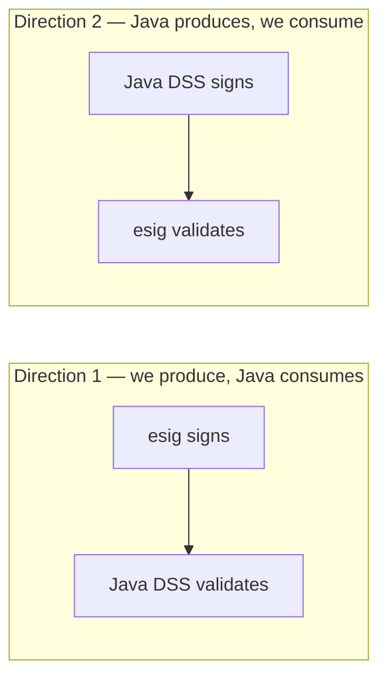

# Verifying Java DSS interop

The whole claim of this library is that it agrees with Java DSS. You should not
take that on faith, and this page is how to check it for your own documents.

It is also the page to read before filing an interop bug — a good report is
short, and this explains what makes it short.

## The two directions

Interoperability has two halves, and they fail independently.



**Direction 1** catches structural mistakes: a mis-encoded attribute, wrong
canonicalization, a byte range off by one. **Direction 2** catches
interpretation mistakes: a check applied differently, a field read from the
wrong place, an enumeration mapped wrongly.

Both are exercised by the port's own test suite. See
[Methodology](../compatibility/methodology.md) for how, and
[The numbers](../compatibility/numbers.md) for what it currently measures.

## Checking direction 1: does Java accept what we produce?

Sign something here, validate it there.

```sh
esig sign contract.pdf -format pades -level T \
    -p12 keystore.p12 -p12-pass env:P12PASS \
    -tsa https://tsa.example.org/tsa \
    -out out.pdf
```

Then run that file through a Java DSS validator — the upstream demo web
application, or a small program using `SignedDocumentValidator` — and compare
what it says with:

```sh
esig validate out.pdf -trust ca.cer -format simple -out ours.xml
```

The indication and sub-indication should be identical. If Java rejects a
document this library validates, that is a **direction-1 defect and it is
serious**: it means we are producing something malformed.

## Checking direction 2: do we agree about a document Java produced?

Take a document signed by Java DSS — including all the upstream test fixtures,
which are freely available — and validate it here:

```sh
esig validate their-document.pdf -trust ca.cer -format simple -out ours.xml
```

Then produce Java DSS's SimpleReport for the same document, with the same trust
configuration and the same validation time, and diff the two.

!!! important "Pin everything before you diff"
    Two validations of the same document legitimately differ if they were run
    differently. Before concluding anything, make sure both sides use:

    - **the same validation time** — `-at 2026-01-15T00:00:00Z` here, an
      explicit validation time there. Otherwise "now" differs by seconds and
      time-sensitive checks can flip;
    - **the same trust anchors** — the same certificates, not "roughly the
      same set";
    - **the same policy** — the bundled ETSI policy on both sides, or the same
      custom file passed to both;
    - **the same locale** — message text is localised; `en` on both sides.

    Most reported "mismatches" are one of these four.

## Diffing the reports properly

Not all four [reports](../concepts/reports.md) are equally good for this.

**Diff the DetailedReport, not the SimpleReport.** The SimpleReport tells you
*that* the verdicts differ; the DetailedReport tells you *which check*, in which
building block, on which certificate. Its `<Name Key="…">` message identifiers
are the same on both implementations, so they diff cleanly.

**Ignore the identifiers.** Signature and certificate ids (`S-…`, `C-…`,
`T-…`) are content-derived digests. They *should* agree, and the port's own
harness compares them exactly — but if only the ids differ and every
indication matches, that is a different and much less severe class of problem
than a verdict divergence. Say which you are seeing.

**Attach the diagnostic data.** It is the input to the whole process, it is
self-contained, and it contains no conclusions. Given the same diagnostic data
and the same policy, both implementations should reach the same verdict — so
if you supply it, whoever picks up the bug can reproduce the disagreement
without your document, your keys or your network.

```sh
esig validate their-document.pdf -trust ca.cer -format diagnostic -out diag.xml
esig validate their-document.pdf -trust ca.cer -format detailed   -out detailed.xml
```

## Reporting a mismatch

There is a dedicated issue template — **Interop mismatch (vs Java DSS)** — on
the [repository's issue tracker](https://github.com/ryftcore/dss-go/issues/new/choose).
It asks for the Java DSS version, this library's version or commit, the input
document, and the two reports, because those four things are what make a
mismatch reproducible.

Please include:

1. **Which direction** — did Java reject ours, or do we disagree about theirs?
2. **The exact Java DSS version.** Behaviour changes between releases; this
   port's baseline is stated in `UPSTREAM.md`.
3. **The document**, or a minimal fixture that reproduces it, with anything
   sensitive removed.
4. **Both reports**, diagnostic data preferred, from validations pinned as
   above.
5. **The specific field or check that differs.** "The verdicts differ" is a
   starting point; "XCV's revocation-freshness check is OK in Java and NOT OK
   here" is a bug report someone can act on within the hour.

!!! danger "Never attach a private key or a real credential"
    If reproducing needs a signature, generate a throwaway self-signed key. No
    issue should ever require your production key material.

## Re-running the port's own comparisons

The repository ships the Java-produced oracle dumps and the Go-side comparisons
that consume them. From a full checkout (which includes the `corpus/` tree):

```sh
cd dss
go test ./harness/... -count=1 -v
```

That re-checks this implementation against output recorded from a real Java DSS
6.5.RC1 build. It does **not** regenerate that output — doing so needs a Java
toolchain and a built upstream classpath, and the recipe is documented in
`dss/harness/README.md` for anyone who wants to. The repository's
`Interop (Java DSS oracle comparison)` workflow is manual-only for exactly this
reason, and is honest about it in its own header comment.

## Next

- [Methodology](../compatibility/methodology.md) — how parity is established
  and what "zero tolerance" means here.
- [Known gaps](../compatibility/known-gaps.md) — the divergences that are known
  and tracked, so you can check before filing.
