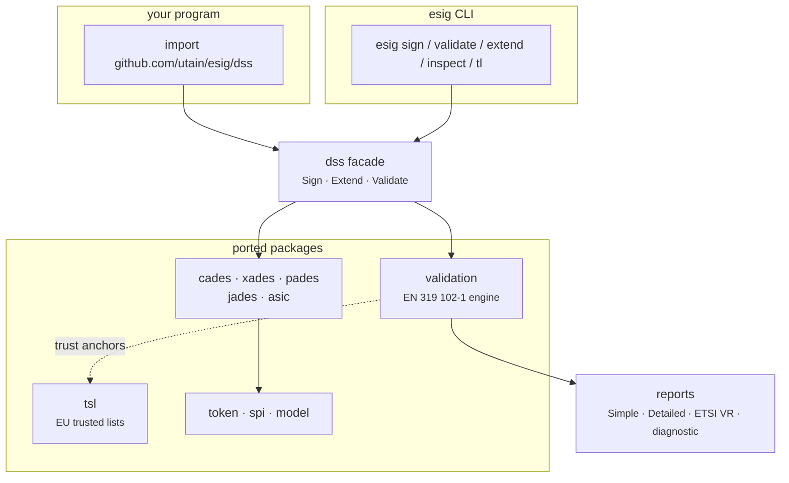

# esig

**A pure Go library for creating and validating digital signatures — a port of
the European Commission's [DSS](https://github.com/esig/dss) library.**

If you have to sign a PDF so that an EU authority will accept it, check whether
an invoice's XML signature is still valid seven years after it was made, or
answer the question *"is this signature qualified under eIDAS?"* — that is what
this library is for.

```go
import "github.com/utain/esig/dss"
```

It is a port, not a reimplementation. Wherever [Java DSS
6.5](https://github.com/esig/dss) has a class, there is a Go file that follows
it and names it in a `Ported from` header — every check, every enumeration
value, every report field. The exception is the machinery DSS itself delegates
to third-party libraries: the ASN.1/CMS, PDF, JOSE and canonicalization engines
have no Java DSS class to mirror, so they were written against the specifications
and then held to BouncyCastle's, PDFBox's, jose4j's and Santuario's actual output
byte for byte. Either way the port is held to the original by a test suite that
compares its output against dumps produced by Java. See
[Compatibility](compatibility/methodology.md) for how that is verified and
[The numbers](compatibility/numbers.md) for what is actually measured.

---

## New here? Start with the concepts

Digital signatures in the European sense are not "sign the bytes with a private
key". They are a small standards stack, and most of the confusion comes from
not knowing which layer a term belongs to.

<div class="esig-cards" markdown>

<div markdown>
### The container
**[Signature formats](concepts/signature-formats.md)** — CAdES, XAdES, PAdES,
JAdES, ASiC. Which one you need is decided almost entirely by what you are
signing: bytes, XML, a PDF, JSON, or a bundle of files.
</div>

<div markdown>
### The lifetime
**[Signature levels](concepts/signature-levels.md)** — B, T, LT, LTA. How long
the signature has to stay verifiable after the signer's certificate expires,
and what has to be embedded now to make that possible later.
</div>

<div markdown>
### The verdict
**[How validation works](concepts/validation.md)** — why the answer is
<span class="verdict pass">TOTAL_PASSED</span> /
<span class="verdict indeterminate">INDETERMINATE</span> /
<span class="verdict fail">TOTAL_FAILED</span> and not a boolean, and what the
middle one is telling you.
</div>

<div markdown>
### The trust
**[Trust, eIDAS and qualification](concepts/trust-and-eidas.md)** — trust
anchors, the EU trusted lists, and the difference between "this signature
verifies" and "this signature is qualified".
</div>

</div>

Then go to **[Getting started](getting-started.md)** to sign and validate
something in about twenty lines.

---

## How the pieces fit

Three things ship in this repository, layered on each other.



**The library.** 115 exported packages mirroring the upstream Maven modules and
their Java packages. The [`dss`](https://pkg.go.dev/github.com/utain/esig/dss)
root package is a thin facade over them covering the two things most programs
need — sign a document, validate a document. Everything else stays reachable in
the packages underneath, which are fully exported and documented on
[pkg.go.dev](https://pkg.go.dev/github.com/utain/esig/dss).

**The CLI.** `esig` is a single binary built on that same facade: sign, extend,
validate, inspect a document, or refresh a local cache of the EU trusted lists.
It is the facade's own living example — anything the CLI does, your program can
do the same way.

**The reports.** Validation does not return a boolean. It returns four
documents of increasing detail, in the same XML schemas Java DSS emits, so
existing tooling reads them unchanged. See
[The four reports](concepts/reports.md).

---

## Honest scope

Things this port deliberately does **not** do, so you find out now rather than
three days in:

- **No HTTP clients for time-stamping or revocation data in the library.**
  Upstream's `dss-service` module (`OnlineTSPSource`, `OnlineCRLSource`,
  `OnlineOCSPSource`) is not part of this port. The library ships a local,
  key-based RFC 3161 time-stamp source for tests and self-hosted TSAs; the
  `esig` CLI ships a real RFC 3161-over-HTTP client of its own. Downloading a
  trusted list and fetching an issuer certificate over AIA *do* work — those
  loaders live in `dss-spi` upstream and were ported. See
  [Timestamps and TSAs](guides/timestamps-and-tsas.md).
- **No REST or SOAP remote-signing services.** Upstream's remote-service
  modules and their clients are out of scope.
- **No visible PDF signature appearances.** A PAdES signature field, its
  rectangle and an empty appearance stream are produced; painting an image or a
  text block into it is not supported — there is no rasteriser in the native
  PDF engine.
- **PKCS#12 key stores only.** JKS, PKCS#11, the Windows certificate store and
  the macOS Keychain are all JCA providers with no Go counterpart and are not
  supported. PKCS#12 is fully supported, including RSA, ECDSA, Ed25519 and DSA
  keys.

The complete, itemised list — including the parity gaps found by the port's own
differential testing — is on [Known gaps](compatibility/known-gaps.md). It is
kept honest deliberately: in a signature library, an overclaim in the docs is
as much a defect as a bug in the code.

---

## Where to look for what

| You want… | Go to |
|---|---|
| To understand the vocabulary | [Concepts](concepts/signature-formats.md) |
| To get something working | [Getting started](getting-started.md), then the [Guides](guides/sign-a-pdf.md) |
| The API reference | [pkg.go.dev](https://pkg.go.dev/github.com/utain/esig/dss) — this site never duplicates godoc |
| To know how far the Java parity goes | [Compatibility](compatibility/methodology.md) |
| To translate Java DSS code you already have | [Migrating from Java DSS](migrating-from-java/index.md) |
| Short answers | [FAQ](faq.md) |

## Licence and attribution

esig is a derivative work of [esig/dss](https://github.com/esig/dss) and is
distributed under the **LGPL-2.1**, the same licence as the original. Upstream
copyright is held by the European Commission and the DSS contributors; the
`NOTICE` file in the repository root carries the full attribution, and every
ported source file names the Java file it came from in its header.

**This project is not affiliated with or endorsed by the European Commission or
the DSS project.**
